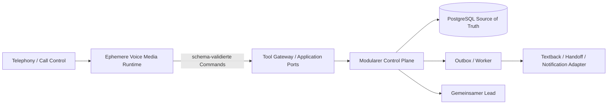

# Systemarchitektur und Modulgrenzen

## Architekturform

Die Anwendung startet als mandantenfähiger modularer Monolith. API und Worker
werden gemeinsam versioniert, die Domänenmodule bleiben jedoch explizit
getrennt. Persistierte Events entkoppeln Nebenwirkungen. Services werden nur
bei nachgewiesenem Skalierungs-, Sicherheits-, Verfügbarkeits- oder
Teamownership-Bedarf extrahiert.

Voice-first ändert diese Control-Plane-Entscheidung nicht. Realtime-Audio hat
jedoch andere Lebensdauer-, Latenz- und Geheimhaltungsanforderungen als
persistente Fachprozesse. Deshalb entscheidet `V-001`, ob die ephemere
Media-Runtime als eigener Prozess/Service oder als isolierter Runtime-Baustein
umgesetzt wird. Sprache, Framework und Anbieter werden nicht vorweggenommen.

Verbindliche Entscheidungen stehen in [den ADRs](../adr/README.md).

## Module

| Modul | Besitzt | Darf nicht besitzen |
|---|---|---|
| Identity/Tenancy | Tenant, Membership, Rollen, Tenant-Kontext | Provider-Accounts, Leads |
| Onboarding/Config | Betriebsprofil, Öffnungszeiten, Nummernkonfiguration, Templates | Zustellstatus, Abrechnung |
| Telephony | Call, CallEvent, TelephonyPort | Nachrichtenversand |
| Voice Control | Agent-/Policyversion, KnowledgeSnapshot, VoiceSession-Metadaten, Disclosure-/Handoffzustand | Audio, Rohtranskript, beliebige Tools |
| Textback | Channel-Eligibility, TextbackAttempt, Fortsetzungs-/Fallbackregeln | Provider-SDK, unabhängiger zweiter Lead |
| Conversations | Conversation, Message, Zustellzustand | Tenant-Authentifizierung |
| Leads | Lead, Status, Notiz, Assignment | Webhookvalidierung |
| Notifications | E-Mail-/Messaging-Ports, Versandorchestrierung | Lead-Fachregeln |
| Billing | Plan, Subscription, UsageRecord, Preis-Snapshot | Payment-SDK außerhalb Adapter |
| Compliance | CommunicationPermissionEvidence, RetentionPolicy, ErasureRequest, AuditEvent | beliebige Providerlogik |
| Admin/Ops | Supportzugriff, Feature Flags, Betriebsaktionen | Umgehung von Audit/RLS |

## Drei Ausführungsebenen



1. **Control Plane:** Tenant, Konfiguration, versionierte Fakten/Policies,
   Calls, Leads, Permission, Audit, Usage und Retention im modularen Monolithen.
2. **Media Plane:** Telefonieaudio, STT, begrenzter Dialog und TTS nur für die
   laufende Session. Audio, Rohtranskript und Promptinhalt werden nicht
   persistiert oder in Queue/Logs/Traces transportiert.
3. **Effect Plane:** Die Voice-Runtime darf ausschließlich kurzlebig
   autorisierte, schema-validierte Commands an das Tool Gateway senden.
   Lead-, Handoff-, Textback-, Usage- und Auditwirkung entsteht idempotent im
   Control Plane, nie direkt aus einem Modell- oder Provider-SDK.

## Kommunikationsregeln

- Synchron innerhalb eines Use Cases über explizite Application-Service-Ports.
- Asynchron für Nebenwirkungen über Transactional Outbox und Queue.
- Realtime-Audio wird nicht in Inbox/Outbox gespeichert oder replayt. Bei
  Sessionverlust gilt sicherer Handoff, erlaubter Callback/Textback oder
  kontrolliertes Ende statt Rekonstruktion aus Rohinhalt.
- Keine direkten Repository-Aufrufe über Modulgrenzen.
- Keine zyklischen Modulabhängigkeiten.
- Gemeinsame Pakete enthalten technische Querschnittsfunktionen oder stabile
  Verträge, keine Ablage für geteilte Geschäftslogik.

## Modulinterne Struktur

```text
<module>/
├── domain/          # Aggregate, Value Objects, Domain Events; frameworkfrei
├── application/     # Use Cases, Ports, Commands/Queries
├── adapters/
│   ├── inbound/     # REST, Webhook, Queue Consumer
│   └── outbound/    # DB, Provider, Queue Producer
└── module.ts        # NestJS-Komposition
```

Domain und Application importieren keine NestJS-Controller, ORM-Modelle oder
Provider-SDKs. Boundary-Regeln und Architekturtests erzwingen dies.

Die Voice-Runtime importiert ebenfalls keine Repositories. Sie kennt
CallControl-/Media-, STT-, DialogModel-, TTS-, Handoff-, KnowledgeSnapshot- und
ToolGateway-Ports. Tenant-, Tool-, URL- und Argumentautorisation bleibt
serverseitig im Control Plane.

## API-Grenzen

- Produkt-API unter `/api/v1`, vertraglich durch OpenAPI.
- Provider-Webhooks haben getrennte Endpunkte und Sicherheitsanforderungen.
- Web nutzt einen aus OpenAPI generierten TypeScript-Client.
- Zustandsänderungen erfolgen nur über Use Cases; ungültige Übergänge liefern
  stabile Domain Errors ohne Seiteneffekt.
