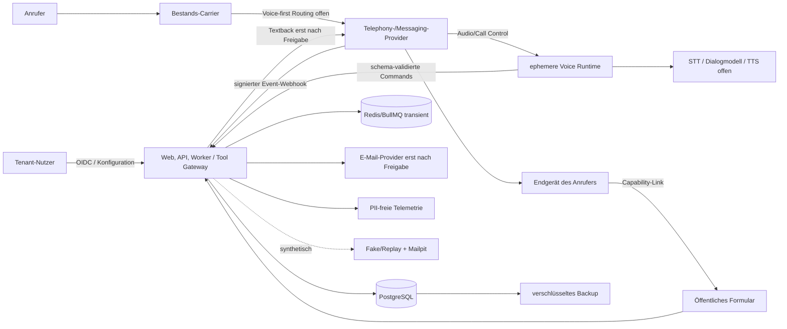

# Datenflüsse und Dateninventar

- Status: `research_hypothesis`; alle Realflüsse `real_blocker`
- Stand: 2026-08-11
- Owner: Product/Privacy/Security/Engineering
- Betreiber: `[PLATTFORMBETREIBER_OFFEN]`
- Scope: gemeinsamer Voice-first-/Textback-MVP; keine Realfreigabe

## 1. System- und Vertrauensgrenzen

Vertrauensgrenzen bestehen zwischen Browser und Produkt, öffentlichem Formular
und Tenantbereich, Produkt und jedem Provider, Runtime und Persistenz,
Tenantdaten und Support sowie Produktiv-, Test- und Analyticsumgebung. Carrier,
Provider, Endgeräte, E-Mail-Postfächer und Backups besitzen eigene Kopien und
Löschsemantiken. Control Plane, ephemere Media Plane und Effect Plane sind
separate Trust Boundaries. Telefonie-, STT-, Dialogmodell- und TTS-Anbieter
werden je juristischer Einheit betrachtet; eine gemeinsame Marke hebt diese
Grenzen nicht auf.

## 2. Ende-zu-Ende-Flows

| ID | Modus | Ablauf | Datenklassen | Status und Gate |
|---|---|---|---|---|
| `FLOW-00` | fake | synthetischer Inbound Call -> simuliertes Audio -> KI-Hinweis -> begrenzter Dialog/Handoff -> schema-validierter Lead-Command -> gemeinsamer synthetischer Lead -> optional positive Fake-Textback-Eligibility -> Fake Message/Formular -> Mailpit/Audit | `DATA-08`–`DATA-20`, `DATA-27`, `DATA-V01`–`DATA-V09` | nach jeweiligem Gate erlaubt; Egress zu Telefon, Voice-, Modell-, SMS-, ESP- und Paymentprovidern technisch verweigern |
| `FLOW-01` | fake/real | Nutzer -> Keycloak OIDC Code/PKCE -> sichere Websession -> API -> Membership/Tenant-Kontext -> Audit | `DATA-01`–`DATA-04`, `DATA-18`, `DATA-19`, `DATA-26` | Realbetrieb erst ab `G2`; Providerwahl nicht erforderlich |
| `FLOW-02` | fake/real | Tenant-Nutzer -> Betriebsprofil, Nummer/Routing, Voice-Policy, KnowledgeSnapshot, Disclosure/Handoff, Textbackregeln -> Versionierung/Audit -> Voice-/Text-Faketest -> Aktivierung | `DATA-04`–`DATA-07`, `DATA-18`, `DATA-25`, `DATA-V03`–`DATA-V05` | nur Fake-Aktivierung bis Nummern-, Voice-, Template-, DSFA- und Legal-Freigabe |
| `FLOW-03` | real | Caller -> Carrier -> noch zu entscheidendes Voice-first-Routing -> CPaaS -> authentisierte Call-/Media-Session -> kanonischer Call/VoiceSession | `DATA-05`, `DATA-08`–`DATA-10`, `DATA-24`–`DATA-26`, `DATA-V01`, `DATA-V07`, `DATA-V08` | `real_blocker`: TDDDG/TKG, Topologie, Providerkette, DPA/TIA, No-Retention und Accounttests offen |
| `FLOW-04` | real | expliziter Voice-Textwunsch oder freigegebener unvollständiger CallOutcome -> Channel-Eligibility/Permission/Suppression/Entitlement -> Message/Usage atomar -> Provider/Carrier/Endgerät -> Statuscallback | `DATA-06`, `DATA-07`, `DATA-10`–`DATA-13`, `DATA-18`–`DATA-21`, `DATA-V03` | `real_blocker`: erste SMS, In-call-Permission, Absender, Widerspruch und Kosten ungeklärt |
| `FLOW-05` | fake/real | Capability-Link -> Tokenprüfung/-exchange -> minimales Formular -> idempotente Submission -> Lead -> Tenant-Dashboard | `DATA-12`, `DATA-14`–`DATA-16`, `DATA-18`–`DATA-20` | Fake erlaubt; real erst mit Transparenz, Feldminimum, Retention und Security-Abnahme |
| `FLOW-06` | fake/real | Lead -> minimale E-Mail/tenantgebundener Link; Fachereignisse -> Audit, pseudonyme Analytics und PII-freie Telemetrie | `DATA-17`–`DATA-21`, `DATA-23`, `DATA-24` | Mailpit/Fake erlaubt; realer ESP und Analyticsanbieter separat freigeben |
| `FLOW-07` | fake/real | verifizierte Anfrage -> systemweites Lookup -> Export oder idempotente Löschung/Suppression -> Provider-/Backup-Nachlauf -> inhaltloser Nachweis | `DATA-07`, `DATA-18`, `DATA-22`–`DATA-25` | Prozessentwurf; produktive Ausführung erst nach `B-004`/`PO-004` |
| `FLOW-V01` | voice | Caller/Telephony -> flüchtige Audioframes -> STT -> flüchtiges Transkript -> begrenzte Dialog-State-Machine/Modell -> TTS -> Caller | `DATA-V01`–`DATA-V03`, `DATA-V07`, `DATA-V08` | synthetisch nach `G0V` und technischen Abhängigkeiten; real benötigt vollständige DSFA, Legal, Safety, Security und Providerfreigabe |
| `FLOW-V02` | voice | nicht überspringbarer KI-Hinweis -> Alternativpfad -> Safety-/Confidence-Policy -> DTMF/Sprach-Handoff oder kontrolliertes Ende | `DATA-V03`–`DATA-V05`, `DATA-V07` | vor Realanruf unabhängig freigeben; keine generative Verzögerung nach Safety-Trigger |
| `FLOW-V03` | voice/fake | bestätigte strukturierte Voice-Felder -> tenant-/sessiongebundener ToolGateway-Command -> idempotent genau ein Lead -> optional `TextbackRequested` in `FLOW-04` | `DATA-10`, `DATA-15`, `DATA-16`, `DATA-18`–`DATA-21`, `DATA-V03`, `DATA-V06`, `DATA-V07` | synthetisch erlaubt nach Isolation/Use-Case-Vertrag; Summary real erst nach `V-004`/DSFA/Legal; Rohdatenpersistenz verboten |

## 3. Gemeinsames MVP-Dateninventar

### 3.1 Fachliche und technische Zuordnung

| ID | Modus | Datenart und typische Felder | Betroffene | Quelle -> Empfänger | Zweck | Owner / Zugriff |
|---|---|---|---|---|---|---|
| `DATA-01` | fake/real | Tenant-/Organisationsdaten: UUID, Firma/Inhaber, Gewerk, Zeitzone, Status, Plan | Inhaber, Ansprechpartner | Tenant-Nutzer -> API/PostgreSQL | `PUR-01`, `PUR-10` | Tenancy/Product; Tenant-Owner, eng begrenzter Support |
| `DATA-02` | fake/real | OIDC-Subjekt, Name/E-Mail, Passwort-Hash beim IdP, MFA/Recovery, Session-, Login-, IP-/Gerätesicherheitsdaten | Tenant-Nutzer, Support | Nutzer -> Keycloak/Web/API | `PUR-02`, `PUR-08` | Identity/Security; Nutzer, Identity-Admin, Security-JIT |
| `DATA-03` | fake/real | Membership, Tenant-Referenz, Rolle, Einladung, Aktivität, Rollenänderung | Tenant-Nutzer | Tenant-Owner/API -> PostgreSQL | `PUR-01`, `PUR-02` | Tenancy; Tenant-Owner, autorisierte Nutzer, Audit |
| `DATA-04` | fake/real | Betriebsprofil, Anschrift/Kontakt, Eskalationskontakt, Öffnungszeiten, Feiertage, Zeitzone, Version | Inhaber, Mitarbeitende | Tenant-Nutzer -> Onboarding/PostgreSQL | `PUR-03` | Onboarding/Config; Tenantrollen, Support nur JIT |
| `DATA-05` | real | Tenant-E.164 verschlüsselt plus Suchhash, Provider-/Routingref, Besitz-/Verifikationsnachweis, Voice-first-/Handoff-Routingstatus | Anschlussinhaber, Tenant | Tenant/Provider -> Config/PostgreSQL/Provider | `PUR-03`, `PUR-04` | Config/Telephony; Tenant-Admin, Provider-Adapter, Support-JIT |
| `DATA-06` | fake/real | Template-, Link-, Hinweis- und Policyversion, Variablen, Kanal, Ruhezeit, Cooldown, Aktivierungsactor/-zeit | Caller, Tenant-Nutzer | Product/Legal/Tenant -> Config/PostgreSQL | `PUR-03`, `PUR-05` | Product/Config/Legal; versionierte freigegebene Bearbeitung |
| `DATA-07` | real | `CommunicationPermissionEvidence`: Nummernhash/verschlüsselt, Zweck, Kanal, Quelle, Policyversion, Status, Widerspruch/Suppression | Caller | Caller/Tenant/Support -> Compliance/PostgreSQL | `PUR-05`, `PUR-11` | Compliance; minimaler Fachzugriff, kein pauschales Consent-Modell |
| `DATA-08` | fake/real | Webhook Raw Body mit From/To, Header ohne Secrets, Provider-/Event-ID, IP, Empfangszeit, Body-/URL-Hash, Validierungsstatus | Caller, Tenant | Provider/Fake -> Inbound Adapter/Inbox | `PUR-04`, `PUR-08` | Telephony/Security; Adapter, eingeschränkte Ops |
| `DATA-09` | fake/real | Call/CallEvent: interne/provider IDs, From/To E.164 plus Hash, Richtung, Call-/Leg-/Outcome-Status, Sequenz, Zeit/Dauer, Correlation | Caller, Tenant | Inbox/Call Control -> Telephony/PostgreSQL | `PUR-04` | Telephony; Tenant-Fachzugriff minimiert, Ops nur Metadaten |
| `DATA-10` | fake/real | Inbox/Outbox/Job: IDs, Typ, Tenantref, Idempotency Key, Retry/Lease, Fehlercode, DLQ-/Requeue-Actor und Grund | indirekt Caller/Tenant | App -> PostgreSQL/Redis | `PUR-08` | Engineering/Ops; IDs statt Payload/PII |
| `DATA-11` | fake/real | ChannelEligibility/Attempt: Voice-Outcome-/Caller-Intentref, Konfig-/Permission-/Policyversion, Callref, Nummernhash, Cooldown, Entitlement, Entscheidung/Reason, Zustand/Zeit | Caller, Tenant | Channel Orchestrator -> PostgreSQL | `PUR-05`, `PUR-08` | Textback/Compliance; Tenant-Lesezugriff, Engineering über Reason Codes |
| `DATA-12` | fake/real | Conversation/Message: Zielnummer verschlüsselt, Templateversion, Renderhash, Kanal, Idempotency Key, Status; Capability nur im Klartext zum Empfänger, serverseitig starker Hash/Binding/Expiry | Caller | Textback -> PostgreSQL/Provider/Endgerät | `PUR-05`, `PUR-06` | Conversations; Provider-Adapter, Tenanttimeline ohne Token |
| `DATA-13` | fake/real | ProviderMessageId, DLR/Status, Zeit, Fehlerklasse/-code, Segment-/Kostenmetadaten, Callbackhash | Caller, Tenant | Provider/Fake -> Inbox/Message/Billing | `PUR-05`, `PUR-08`, `PUR-10` | Messaging/Ops/Billing; DLR nicht als Personenbeweis |
| `DATA-14` | fake/real | Formularsecurity: Token-Eingabe/Exchange, Session/CSRF, IP, User-Agent, Rate-/Bot-Signale, Zeit | Formularnutzer | Browser -> Edge/API/kurzer Security Store | `PUR-02`, `PUR-06`, `PUR-08` | Security/Public Form; keine Dritttracker, Token aus Logs/Referrer |
| `DATA-15` | fake/real | Formular/Leadkern: Rückrufnummer, optional Name, Rückrufzeit, Kategorie, grober Ort, begrenzter Freitext, Hinweisversion/-zeit | Caller, weitere genannte Personen | Formular -> Leads/PostgreSQL | `PUR-06` | Leads; Tenantrollen, hochsensibler Freitext eng begrenzen |
| `DATA-16` | fake/real | Leadstatus, Assignment, Historie, interne Notizen, Kontaktzeitpunkte | Caller, Tenant-Nutzer, genannte Dritte | Tenant-Nutzer -> Leads/PostgreSQL | `PUR-07` | Leads; Tenantrollen, Notizen nie öffentlich/Telemetry |
| `DATA-17` | fake/real | Empfänger-E-Mail, minimale Benachrichtigung, tenantgebundener Auth-Link, ProviderMessageId, Status/Bounce | Tenant-Nutzer, Caller indirekt | Notifications -> Mailpit/ESP/Empfängergerät | `PUR-07`, `PUR-08` | Notifications; kein Capability Token oder unnötiger Leadinhalt |
| `DATA-18` | fake/real | Audit: Actorref/-typ, Tenantref, Aktion, Resource-ID/-typ, Requestref, Zeit, Ergebnis/Grund, Supportaktion | Nutzer, Support, Caller indirekt | Use Cases/Admin -> append-only PostgreSQL | `PUR-08`, `PUR-11` | Compliance/Security; keine Nummern, Texte oder Secrets |
| `DATA-19` | fake/real | Telemetrie: Zeit, Env, Service, Trace/Job/Eventtyp, pseudonymer Tenantref, Error Code, Latenz/Queue/Rate; ggf. kurz gehashte/trunkierte IP | Nutzer/Caller indirekt | Dienste -> Logs/Metrics/Tracing | `PUR-08` | Ops/Security; Feld-Allowlist, keine Payload/PII/Token |
| `DATA-20` | fake/real | Produktanalytics `_v1`: EventId, Zeit, Schema, Source, pseudonymer Tenantref, CorrelationId, Testflag | Tenant-Nutzer, Caller indirekt | Fachereignis -> Analytics Store | `PUR-09` | Product/Data; keine Kontakt-/Inhaltsdaten |
| `DATA-21` | fake/real | Plan, Preissnapshot, Subscription, UsageRecord, Source Event, Einheit/Menge/Periode, Korrekturbuchung, Providerkosten; später Billingkontakt/Steuerdaten | Tenant-Ansprechpartner | App/Provider -> Billing/PostgreSQL/Finance | `PUR-10` | Billing/Finance; keine Karten-/Bankdaten im Produkt |
| `DATA-22` | fake/real | Rechteanfrage: Requester, Verifikation, Scope, Status, Quellen-/Providerstatus, Exportartefakt/Downloadtoken, Erasurenachweis, Legal Hold | Betroffene, Tenant-Ansprechpartner | Requester/Support -> Compliance/Object Store | `PUR-11` | Privacy/Support; JIT, risikobasiertes Vier-Augen-Prinzip |
| `DATA-23` | fake/real | Supportzugriff: Actor, Ticket/Grund, Scope, Tenant, Freigabe/MFA, Start/Ablauf, gelesene/geänderte Ressourcen, Ergebnis | Tenant-Nutzer, Caller | Support/Admin -> Audit Store | `PUR-08`, `PUR-11` | Admin/Security; JIT/read-only default, kein stilles RLS-Bypass |
| `DATA-24` | fake/real | verschlüsselte Snapshots persistenter Klassen, Snapshot-/Key-/Restoremetadaten | alle persistent Betroffenen | PostgreSQL/Object Store -> EU-Backup | `PUR-08`, `PUR-11` | Operations/Security; Restore streng getrennt und auditierbar |
| `DATA-25` | real | Provider-/KYC-/Vertrag: Account-/Applicationrefs, Business-/Vertreterdaten, Anschrift, KYC-Dokumente, DPA/TIA, Subprozessoren, Region, Billing | Inhaber, Vertreter | Betreiber/Tenant -> Vertragsregister/Providerportal | `PUR-03`, `PUR-10`, `PUR-11` | Legal/Finance/Ops; nicht unkontrolliert in Produkt-DB |
| `DATA-26` | fake/real | Webhook/API/OIDC/ESP/Payment Secrets, Feld-/Backupkeys | keine Betroffenen-PII; Hochschutz | autorisierter Admin -> Secret Store/Runtime | `PUR-02`, `PUR-08` | Security/Runtime; nie Repo, DB, Log oder Export |
| `DATA-27` | fake | synthetische Tenant/User/Call/Form/Lead-IDs, nicht zustellbare Kontakte, synthetische Contract-Fixtures und Fehlerfälle | keine reale Person | Repo/Testgenerator -> Test-DB/Fake-Adapter | `PUR-12` | Engineering/QA; keine echte oder pseudonymisierte Produktivkopie, Egress default-deny |

### 3.2 Speicher-, Rollen- und Löschzuordnung

| Daten | Speicher/externe Kopie | Sensitivität | Rollenhypothese | Retention/Löschweg | Status/Blocker |
|---|---|---|---|---|---|
| `DATA-01`–`DATA-04` | Keycloak/PostgreSQL/Backup | intern bis vertraulich | Plattform für eigene Accounts teils Verantwortlicher; sonst Tenant/Plattform je Zweck prüfen | `RET-07`, Audit `RET-08`, Backup `RET-12` | Betreiber, Vertrag und Rollen offen |
| `DATA-05` | PostgreSQL, Provider/Carrier, Backup | hoch; Nummer/Verifikation | Tenant voraussichtlich Verantwortlicher; Plattform/Providerrollen offen | `RET-07`, `RET-12`, `RET-14` | Nummernmodell, TDDDG/TKG und Provider offen |
| `DATA-06`–`DATA-07` | PostgreSQL, Provider/Carrier, Backup | hoch; Kommunikationsregel/-nachweis | Tenant voraussichtlich Verantwortlicher; Plattform/Providerrollen offen | `RET-07`, `RET-08`, `RET-12`, `RET-13` | SMS-Erlaubnis, Widerspruch und Suppression offen |
| `DATA-08` | kurzlebige Inbox; Provider-/Edgekopie | hoch; Kommunikationsmetadaten/Raw | Rollen nach TDDDG/DSGVO offen | `RET-01`, `RET-02` | Realpayload verboten bis Klassifikation |
| `DATA-09`–`DATA-13` | PostgreSQL, Redis transient, Provider/Carrier, Backup | hoch; Kontakt-/Kommunikationsdaten | Tenant voraussichtlich Verantwortlicher; Plattform Auftragsverarbeiter; Provider ggf. gemischte Rolle | `RET-02`–`RET-06`, `RET-08`, `RET-11`, `RET-12` je Unterklasse | Callsemantik, Erst-SMS und Providervertrag offen |
| `DATA-14` | Edge/API, kurzer Security Store; Endgerät | hoch; Token/IP/Security | Betreiber/Tenant je Formularzweck prüfen | `RET-04`, `RET-09` | TDDDG § 25, Tokenlaufzeit und DSR-Verifikation offen |
| `DATA-15`–`DATA-17` | PostgreSQL, Backup, ESP/Postfach | hoch bis sehr hoch; Freitext kann Art.-9-Daten enthalten | Tenant voraussichtlich Verantwortlicher, Plattform/ESP Auftragsverarbeiter | `RET-07`, `RET-12` | Feldminimum, Transparenz, Notfall und Retention offen |
| `DATA-18`–`DATA-20` | Audit DB, Log-/Metric-/Analytics Store | pseudonym/vertraulich | Plattform für Security/Produktzwecke ggf. eigener Verantwortlicher | Audit/Security `RET-08`, Ops `RET-09`; `DATA-20` nur synthetisch `RET-00`, reale Analytics-Policy offen | Zweck-/Rollenabgrenzung und Anbieter offen |
| `DATA-21` | PostgreSQL/Finance/Provider | vertraulich; später Steuer-/Vertragsdaten | Plattform Verantwortlicher für eigene Abrechnung; Tenantdatenrollen prüfen | `RET-11` | gesetzliche Klassifikation erst bei Echtgeld |
| `DATA-22`–`DATA-24` | Compliance DB, kurzlebiger Object Store, Audit, Backup | hoch; Identitäts-/Gesamtexport | Verantwortlicher führt Rechteprozess; Plattform unterstützt nach AVV | `RET-08`, `RET-10`, `RET-12` | Identitätsprüfung, Legal Hold, Provider-/Backupabschluss offen |
| `DATA-25` | Vertragsregister/Providerportal | hoch; KYC/Vertreter | Plattform/Provider je Pflicht eigenständig oder Auftrag; vertraglich klären | `RET-14`, ggf. klassifizierte Abrechnung `RET-11`, externe Kopie `RET-12` | Betreiber und Provider nicht gewählt |
| `DATA-26` | Secret Store/Memory | kritisch | kein Betroffenenrollenmodell; Security-Verantwortung | `RET-15`: Rotation/Revocation/Zeroize, nicht normale Erasure | technische Implementierung ab `F-003` |
| `DATA-27` | Repo/Test-DB | synthetisch | `not_applicable` für reale Betroffene | `RET-00` | nur zulässig bei nachweislich synthetischen Daten |

## 4. Voice-Dateninventar

Voice ist primärer MVP-Pfad, bleibt aber bis zum kombinierten Pilot-Gate
außerhalb jeder realen Verarbeitung. Die folgende Inventur setzt unmittelbare
MVP-Datenschutzgrenzen, ohne Provider oder Implementierung zu wählen.

| ID | Datenart/Flow | Zweck/Owner/Zugriff | Speicher und externe Kopie | Rolle/Sensitivität | Retention | Status/Blocker |
|---|---|---|---|---|---|---|
| `DATA-V01` | Live-Audioframes aus `FLOW-V01` | `PUR-V01`; Voice Runtime, kein Fach-/Supportzugriff | ausschließlich Memory/Providerstream, kein Object Store/Log | Kommunikationsinhalt, sehr hoch; Rollen/TDDDG offen | `RET-V00` | `real_blocker`: DSFA, Provider-No-Retention, § 201 StGB/TDDDG |
| `DATA-V02` | partielle/finale Rohtranskripte, Sprache, Confidence, Zeit | `PUR-V01`; nur laufende Session | Memory/Providercache; keine DB/Trace/Promptlogs | Inhalts-/mögliche Art.-9-Daten, sehr hoch | `RET-V00` | Persistenz und Training verboten |
| `DATA-V03` | Policy-/Promptversion, Dialogzustand, Toolargument/-ergebnis, Bestätigung | `PUR-V01`, `PUR-V02`; Runtime/Tool Gateway | Inhalt nur Memory; in Audit nur Version, State, Resultcode | hoch; Tenant voraussichtlich Verantwortlicher | `RET-V00`, Metadaten `RET-08` | Prompt-/Toolvertrag erst nach `V-001`/`V-003` |
| `DATA-V04` | KI-Hinweis: Textversion, erreicht/abgelehnt, Zeit, Fallback | `PUR-V01`; Compliance/Product | minimales Ereignis in Audit/PostgreSQL, kein Audio | vertraulich; Rollen zu prüfen | `RET-08` | Art.-50-Text und Alternativweg freigeben |
| `DATA-V05` | Safety: Regelhit/Score/Reason, DTMF, Transferziel/-status, Handoff-/Incidentmetadaten | `PUR-V02`; Safety/Human Handoff | PII-arm in Audit/Incident Store; keine Audiosequenz | sehr hoch; Notfall-/Gesundheitsbezug möglich | `RET-08`, exakte Frist Legal | vollständige Safety-/Legal-Abnahme erforderlich |
| `DATA-V06` | strukturierte Summary mit `value`/`unknown`, Confidence, Caller-Bestätigung, Policy-/Schemaversion und menschlicher Korrekturhistorie | `PUR-V03`; Tenantnutzer/Leads | erst nach Freigabe PostgreSQL/Backup; kein Wortlaut und keine rekonstruierbare Audio-/Rohtext-/Quellsegmentreferenz | hoch bis sehr hoch; Tenant voraussichtlich Verantwortlicher | `RET-V01` | `real_blocker` bis `V-004`/DSFA/Legal/Safety |
| `DATA-V07` | Session-/Provider-ID, Latenz, Audiolänge, Token/Zeichen, Kosten, Fehler | `PUR-V03`, `PUR-10`; Ops/Billing | PII-freie Metrik plus minimales Usage Ledger | pseudonym/vertraulich | `RET-08`, `RET-11` | Reidentifikation/Providerkopie prüfen |
| `DATA-V08` | ephemere Credentials, Buffer, Sessionkey | `PUR-V01`, `PUR-08`; Runtime/Security | Memory/Secret Store, kein Log/Backup | kritisch | `RET-V00` | Cleanup-/Leak-Test vor jeder Freigabe |
| `DATA-V09` | synthetisches Testkorpus und Annotationen | `PUR-12`; QA/Safety | versionierter geschützter Testbestand | synthetisch | `RET-00` | keine echten oder pseudonymisierten Produktivgespräche als Testdaten |
| `DATA-V10` | Voiceprint, Sprecher-ID, Emotion, biometrische Kategorie, Recording | kein zulässiger Zweck im Scope | darf nicht erhoben, abgeleitet, gespeichert oder an Providertraining gegeben werden | verboten/biometrisch bzw. hochriskant | `RET-V00` = keine Erhebung | `not_applicable` nur wegen verbindlichem Produktverbot; Änderung benötigt neue ADR/Legal |

## 5. Datenminimierungsregeln

- Telefonnummern E.164-normalisieren, feldverschlüsseln, für Suche getrennt
  hashen und in Logs maskieren; Hashes bleiben personenbezogen.
- Queue, Outbox, Audit, Analytics, Metriken, Traces und E-Mails transportieren
  IDs/Reason Codes statt Payloads.
- Capability Token besitzt mindestens 128 Bit Entropie, wird serverseitig nur
  stark gehasht, an Tenant/Call/Zweck gebunden und nie in Referrer, Analytics,
  Proxylog, E-Mail oder Audit übernommen.
- Formular lädt keine Drittressourcen oder Tracker und fragt keine Diagnose,
  Gesundheit, Alter oder Notfalldetails aktiv ab. Freitext ist kurz, optional,
  sicher gerendert und nicht für Analytics/Training nutzbar.
- DLR bedeutet Provider-/Carrierstatus, nicht sicheren Nachweis, dass die
  richtige Person eine Nachricht gelesen hat.
- Backups, Provider-/Carrierkopien und Empfängergeräte gehören ausdrücklich zur
  Lösch- und Transparenzbetrachtung; eine App-Löschung beseitigt sie nicht sofort.
- Voice verarbeitet Audio und Rohtranskript nur flüchtig. Debugging,
  Stichprobenreview oder Providertraining mit realen Gesprächsdaten ist nicht
  durch einen allgemeinen Support- oder Qualitätszweck gedeckt.

## 6. Offene Datenentscheidungen

| Entscheidung | Owner | Trigger/Blockade |
|---|---|---|
| Betreiberidentität und Rollen je Zweck | Product/Legal | vor Datenschutzinformation, AVV oder Realbetrieb |
| SMS-Einordnung, Absender, Widerspruch und Suppressionsnachweis | Product/Legal | blockiert `FLOW-04` |
| TDDDG-/TKG-Rolle für Call-, Media-, Transfer- und erfolglose Verbindungsdaten | Legal/Provider | blockiert `FLOW-03`/`FLOW-04`/`FLOW-V01` |
| Voice-first-Nummerntopologie, Original-Caller-ID, Call-Legs und Ausfallrouting | Product/Engineering/Legal (`V-001`) | vor Anbieterentscheid/Realbetrieb |
| CallOutcome-/Kanalwechselregel | Product/Engineering/Safety (`DEC-005`) | vor `E-001`/`M-001`/Realbetrieb |
| Formularminimum/Freitext | Product/Privacy (`DEC-009`) | vor `M-005` |
| Token-/Attribution-Lebensdauer | Product/Data (`DEC-011`) | vor `M-005`/`B-006` |
| Notfalltext und menschlicher Pfad | Product/Legal/Safety (`DEC-006`) | vor Formular- oder Voice-Realbetrieb |
| Provider-/ESP-/Hosting-/Analytics-Subprozessoren und Transfers | Legal/Security | vor jeweiliger externer Verbindung |
| Telefonie-/STT-/Dialogmodell-/TTS-Rollen, vollständige DSFA, AI-Act-Disclosure und No-Retention/No-Training | Product/Legal/Safety/Security | vor jedem Voice-Realanruf |
